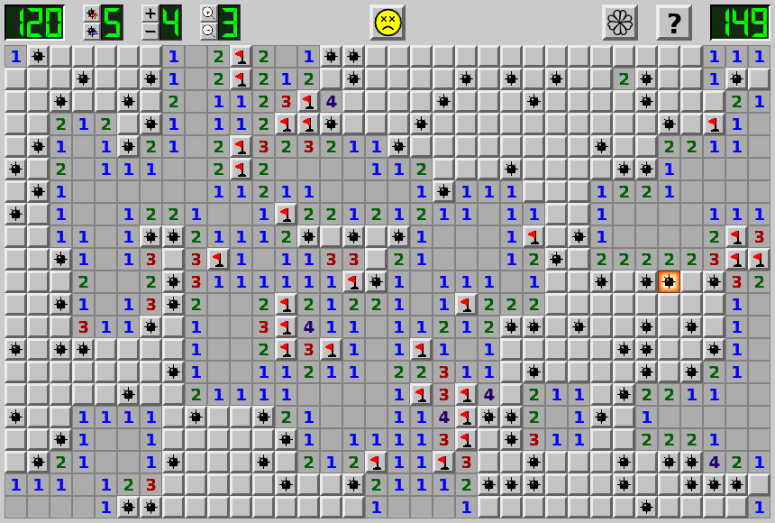

Minesweeper
===========

Minesweeper clone by yakov and 8.5tails.

Screenshots
-----------

Building
--------

**Windows**:

Either run cmake-gui, or "open folder" in Visual Studio.

**Linux**:

Configure (example):

    $ cmake -S . -B build -DCMAKE_CXX_COMPILER=clang++

(Optionally) Change config options:

    $ ccmake build

Press 'c' to configure and then 'g' to generate.

Build:

    $ cmake --build build -v
